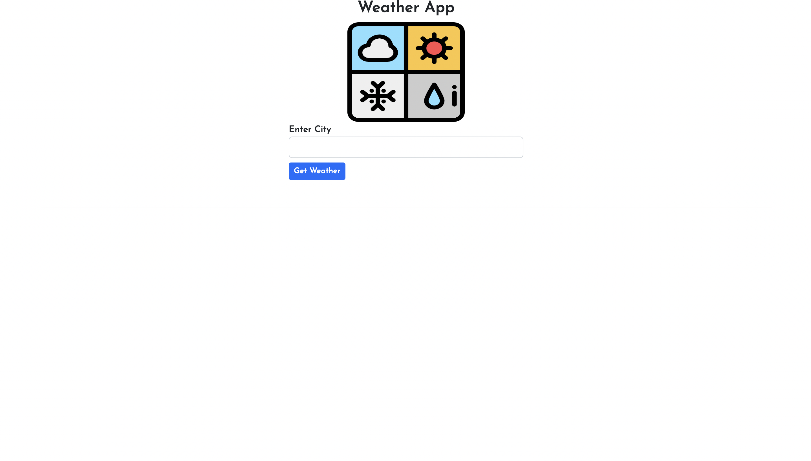
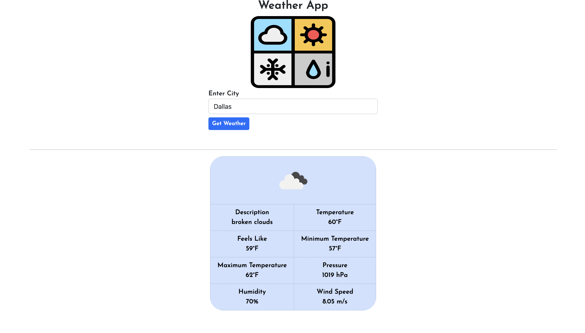
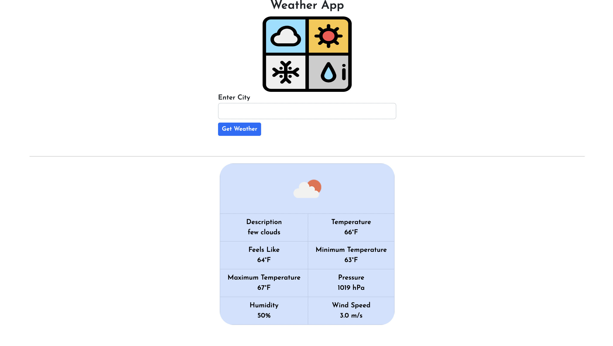

# Weather-App
Web Application that makes calls to Openweathermap Api and display weather information by city.

I created this project to practice Spring MVC and learn Spring Boot, HTTP requests, JSON to POJOs mapping.

Technologies Used:

-Spring Boot

-Thymeleaf

-BootStrap

-Openweathermap Api

Main Page

Look up weather information by city

--

--

--

